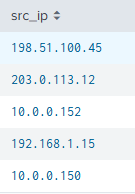
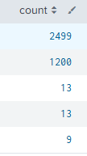
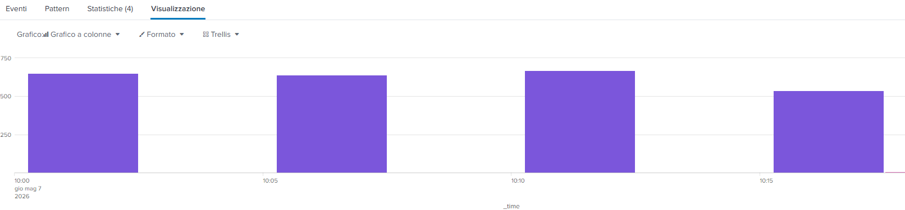
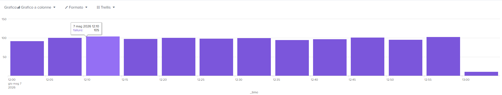

# 1 Informazioni Generali

- **ID ALERT:** INC-2026-0507-BF
- **Data e Ora:** 07/05/2026 14:00
- **Stato:** In fase di Remediation
- **Analista:** Luca Acunzo
- **Severità:** CRITICAL 
# 2 Introduzione

In data 07/05/2026, alle ore 9:17, il sistema di monitoraggio SIEM (Splunk) ha generato un alert di priorità critica riguardante un volume anomalo di login falliti. L'analisi ha confermato che si tratta di un attacco di tipo Brute Force mirato che ha portato alla compromissione dell'account **administrator**. E' stato identificato anche un secondo attacco di tipo Password Spraying su diversi utenti, senza successo.
# 3 Analisi Tecnica dell'Attacco
## 3.1 Indicator of Compromise (IoC)

Tramite query mirata sono stati individuati due vettori di attacco distinti provenienti da indirizzi IP esterni.
- **Query:** 
> `source="splunk_cybersecurity_lab_dataset.csv" host="DESKTOP-8CAJRTO" index="macchina_locale" sourcetype="csv" status="failure" | stats count by src_ip | sort - count | head 5`
- **Risultato:** 
!
- **Vettori di attacco:**
	- **198.51.100.45:** 2499 tentativi di login falliti.
	- **203.0.113.12:** 1200 tentativi di login falliti.
## 3.2 Analisi del comportamento

L'attaccante ha dimostrato un'alta velocità di esecuzione, tipica di strumenti automatizzati.
- **Query:**
> `source="splunk_cybersecurity_lab_dataset.csv" host="DESKTOP-8CAJRTO" index="macchina_locale" sourcetype="csv" src_ip IN ("198.51.100.45", "203.0.113.12") | timechart span=5m count by status`
- **Risultato: **

- **Analisi:**
	- **Finestra temporale IP 198.51.100.45:** Dalle 10:00 alle 10:15 (2499 tentativi falliti).
	- **Finestra temporale IP 203.0.113.12:** Dalle 12:00 alle 13:00 (1200 tentativi falliti).
# 4 Identificazione dei Target dell'attacco
Identificazione degli account e degli asset target del tentativo di Brute Force.
- **Query:**
> `source="splunk_cybersecurity_lab_dataset.csv" host="DESKTOP-8CAJRTO" index="macchina_locale" sourcetype="csv" src_ip IN ("198.51.100.45", "203.0.113.12") | stats count by user, status`
- **Risposta:**
	- IP 198.51.100.45: Target **administrator** (Brute Force mirato)
	- IP 203.0.113.12: Diversi target (Password Spraying)

# 5 Evidence of Compromise (EoC)
Verifica dei tentativi di autenticazione andati a buon fine originati dagli indirizzi IP censiti.
- **Query:**
> `source="splunk_cybersecurity_lab_dataset.csv" host="DESKTOP-8CAJRTO" index="macchina_locale" sourcetype="csv" src_ip IN ("198.51.100.45", "203.0.113.12") status=success`
- **Risposta:**
	- **Evento Critico:**
		- **Data e Ora:** 07/05/2026 10:19
		- **User:** **administrator**
		- **Sorgente:** 198.51.100.45
		- **Evento:** Login Success
# 6 Valutazione dell'Impatto
L'intrusione ha colpito l'account con i privilegi più elevati del sistema. L'impatto potenziale include:
- Esfiltrazione di dati sensibili aziendali.
- Lateral Movement: Possibile tentativo di infettare altri host della rete.
- Persistenza: Rischio di installazione di backdoor o creazione di nuovi utenti admin nascosti.
# 7 Piano di Remediation e Hardening
## 7.1 Azioni immediate
1. **IP Blocking:** Inibizione immediata del traffico da/verso gli IP `198.51.100.45` e `203.0.113.12` a livello di Firewall perimetrale.
2. **Account Lockout:** Disabilitazione temporanea dell'account **administrator** e terminazione di tutte le sessioni attive.
3. **Password Reset:** Cambio forzato della password con requisiti di complessità elevati
## 7.2 Raccomandazioni a Lungo Termine
- **Implementare MFA (Multi-Factor Authentication):** Obbligatoria per tutti gli account amministrativi.
- **Account Lockout Policy:** Configurare il blocco automatico dell'account dopo 5 tentativi falliti.
# 8 Conclusioni
L'incidente è stato rilevato e analizzato con successo. Sebbene l'accesso iniziale sia avvenuto, la tempestività dell'analisi SOC ha permesso di circoscrivere l'attività dell'attaccante. È fondamentale procedere con un audit completo dei log di sistema nelle ore successive al login riuscito (10:19) per escludere la presenza di persistenza.
