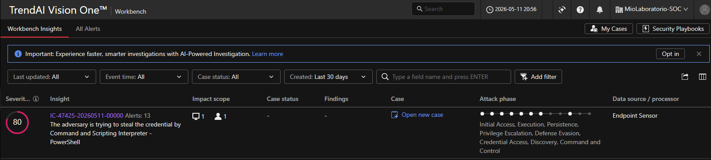
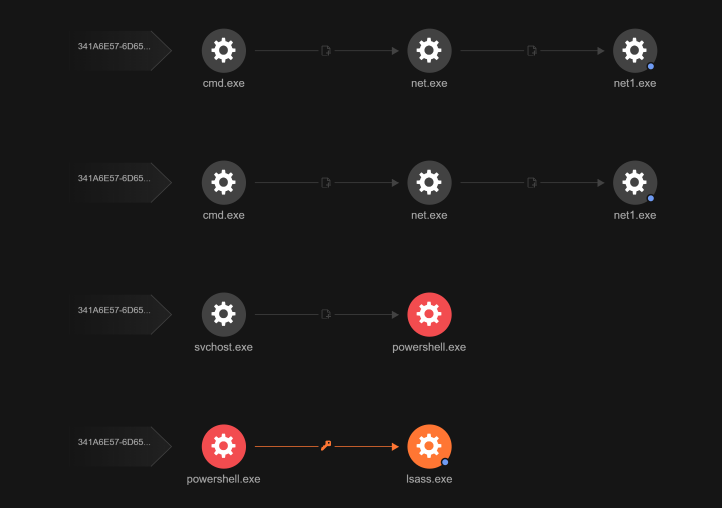
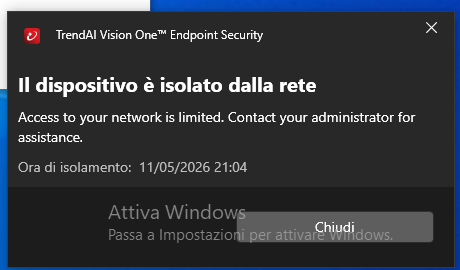
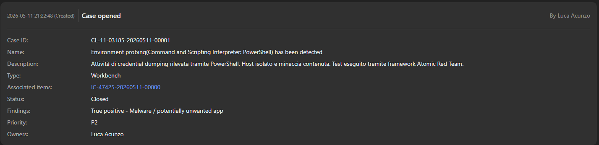

# 1 Informazioni Generali

- **ID ALERT:** IC-47425-20260511-00000
- **ID CASE:** CL-11-03185-20260511-00001
- **Data e Ora Rilevamento:** 11/05/2026 20:56
- **Stato:** Chiuso (Minaccia Contenuta)
- **Analista:** Luca Acunzo
- **Severità:** HIGH (80/100)

# 2 Introduzione ed Executive Summary

In data 11/05/2026, la piattaforma XDR Trend Micro Vision One ha generato un alert ad alta priorità (Severity 80) relativo a un tentativo critico di Credential Dumping sull'endpoint Windows della rete. L'attività sospetta ha coinvolto l'interprete PowerShell per tentare l'accesso alla memoria del processo LSASS. 

L'incidente è stato generato e analizzato all'interno di un laboratorio SOC ibrido, appositamente ingegnerizzato per simulare scenari di attacco reali e testare le capacità integrate di Detection, SIEM Logging e Incident Response aziendali.

# 3 Architettura e Configurazione del Laboratorio SOC

Per condurre questa analisi è stato implementato un ambiente di test strutturato secondo le best practice di Security Integration e System Administration.

## 3.1 Architettura del Sistema
Il laboratorio è basato su un'infrastruttura ibrida composta da tre componenti principali:
- **Endpoint (Vittima):** Una macchina virtuale Windows 10 configurata in modalità Bridge per permettere la comunicazione bidirezionale con il resto della rete.
- **SIEM (On-Premises):** Un server Ubuntu con installato Splunk Enterprise per l'ingestion e l'analisi centralizzata dei log.
- **XDR (Cloud):** La piattaforma Trend Micro Vision One per il rilevamento comportamentale avanzato (EDR) e la Response.

## 3.2 Integrazione SIEM e Log Management
Questa fase ha garantito la centralizzazione affidabile dei log di sicurezza:
- **Installazione Server:** Configurazione di Splunk Enterprise su Ubuntu Server.
- **Abilitazione Ingestion:** Configurazione del server per l'ascolto dei dati in ingresso sulla porta standard 9997 (TCP).
- **Sincronizzazione Temporale:** Verifica e allineamento degli orari (tramite protocollo NTP) tra la macchina Windows e il server Ubuntu. Questo step è fondamentale in fase di analisi forense per garantire che la timeline degli eventi nel SIEM sia perfettamente coerente con quella dell'XDR.

## 3.3 Configurazione dell'Endpoint (Windows 10)
L'endpoint è stato preparato per fornire telemetria sia a livello di log grezzi che di monitoraggio comportamentale profondo:
- **Splunk Universal Forwarder (UF):** Installazione dell'agente UF sulla VM Windows.
- **Vision One Sensor:** Deploy dell'agente XDR per garantire l'hooking dei processi di sistema e l'analisi degli script (AMSI).

# 4 Analisi Tecnica dell'Attacco

## 4.1 Rilevamento XDR (Detection)
La piattaforma XDR ha sollevato un alert critico intercettando un comportamento anomalo tipico degli attacchi di tipo "Living off the Land" (LotL).
- **Alert Triggerato:** "The adversary is trying to steal the credential by Command and Scripting Interpreter - PowerShell"
- **Scope:** L'attacco ha impattato 1 endpoint e 1 utente locale.
- **Evidenza:**

## 4.2 Kill Chain ed Execution Profile (Root Cause Analysis)
L'analisi forense condotta tramite la Workbench dell'XDR ha permesso di ricostruire visivamente l'albero di esecuzione dell'attacco, confermando la natura malevola dell'evento simulato tramite framework Atomic Red Team.
- **Processo Sorgente:** `powershell.exe` (Segnalato in rosso per attività altamente sospetta).
- **Processo Target:** `lsass.exe` (Local Security Authority Subsystem Service).
- **Comportamento Rilevato:** Il grafico (icona a forma di chiave) evidenzia l'aggancio diretto di PowerShell alla memoria di LSASS per il furto di token e hash di password. Parallelamente, è stata rilevata un'attività di *Discovery* e *Reconnaissance* tramite la catena di comandi `cmd.exe -> net.exe -> net1.exe` atta a mappare gli utenti del dominio.
- **Evidenza Forense:**

## 4.3 Visibilità SIEM vs XDR (Hunting)
Durante l'investigazione è stata effettuata una validazione incrociata tra gli strumenti:
- **Splunk (SIEM):** Ha regolarmente indicizzato gli eventi di creazione processo e i tentativi di accesso alle credenziali. 
- **Vision One (XDR):** Grazie all'integrazione nativa con **AMSI** (Anti-Malware Scan Interface), è stato possibile decodificare in tempo reale il payload malevolo direttamente in memoria, permettendo all'analista di confermare la tecnica di attacco e prelevare i corretti Indicatori di Compromissione (IoC).

# 5 Response Management e Remediation

## 5.1 Azioni di Contenimento Immediate
A fronte della conferma del *True Positive* legato a un grave rischio di furto credenziali, è stata eseguita una manovra di risposta immediata per impedire il Lateral Movement o l'esfiltrazione dati.
- **Azione Eseguita:** `Isolate Endpoint` lanciato in tempo reale dalla console XDR.
- **Risultato:** Disconnessione fisica a livello di stack di rete per l'host `DESKTOP-8CAJRTO`. La macchina ha perso l'accesso a internet e alla LAN, isolando di fatto l'attaccante pur mantenendo un tunnel sicuro per la piattaforma XDR.
- **Evidenza Isolamento:**

- **Reset delle Credenziali:** Obbligo di cambio password per l'utente locale coinvolto e per tutti gli account amministrativi che hanno effettuato l'accesso all'endpoint compromesso nelle ultime 24 ore (rischio _Pass-the-Hash_).
- **Sanificazione Host:** Scansione completa dell'endpoint tramite Trend Micro Vision One e strumenti di analisi forense per identificare eventuali file residui o script di persistenza creati durante l'attacco.
- **Revoca Sessioni Attive:** Terminazione di tutte le sessioni attive dell'utente su altre risorse di rete per invalidare eventuali token già esfiltrati.
- **Ripristino Connettività:** Una volta confermata la pulizia dell'host, procedere con la funzione di **Restore Connection** dalla console XDR per reinserire la macchina nella rete aziendale.
## 5.2 Raccomandazioni a Lungo Termine
- **Implementazione di LSA Protection:** Abilitare la protezione aggiuntiva per il processo LSASS tramite Registry o Group Policy (GPO), forzando l'esecuzione del processo come "Protected Process Light" (PPL) per impedire la lettura della memoria da parte di processi non firmati.
- **Restrizione PowerShell:** Implementare il **Constrained Language Mode (CLM)** tramite AppLocker o Windows Defender Application Control (WDAC). Questo limita drasticamente la capacità di PowerShell di invocare API di sistema critiche utilizzate dai tool di dumping.
- **Privileged Access Management (PAM):** Ridurre drasticamente l'uso di account con privilegi amministrativi locali sugli endpoint, adottando il principio del _Least Privilege_ per prevenire l'estrazione di segreti ad alto valore.
- **Formazione e Simulazione:** Pianificare sessioni periodiche di attacco simulato (Purple Teaming) utilizzando framework come Atomic Red Team per validare costantemente l'efficacia delle regole di Detection e i tempi di risposta del SOC.
## 5.3 Case Management e Chiusura
A seguito della neutralizzazione della minaccia, l'incidente è stato formalmente documentato per mantenere la *Chain of Custody* e i KPI del SOC.
- **Case ID:** CL-11-03185-20260511-00001
- **Classificazione:** True Positive - Malware / potentially unwanted app
- **Note di Risoluzione:** *"Attività di credential dumping rilevata tramite PowerShell. Host isolato e minaccia contenuta. Test eseguito tramite framework Atomic Red Team."*
- **Evidenza Chiusura Caso:**

# 6 Conclusioni e Raccomandazioni Future
Il laboratorio ha dimostrato l'assoluta necessità di adottare un approccio XDR unito a un SIEM per contrastare minacce moderne. Mentre sistemi di rilevamento basati su hash (come verificato su VirusTotal, dove il file risultava pulito 0/70) avrebbero fallito, l'analisi comportamentale ha individuato il pericolo istantaneamente.
