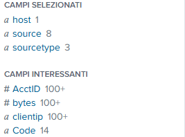

# Selected_Fields
They are default fields of the utmost importance.
# Interesting Field
- The letter "a" next to a field denotes a **string value**.
- The "#" denotes a **numeral**.
- Clicking on a field, you will see a list of **values** for the field

 